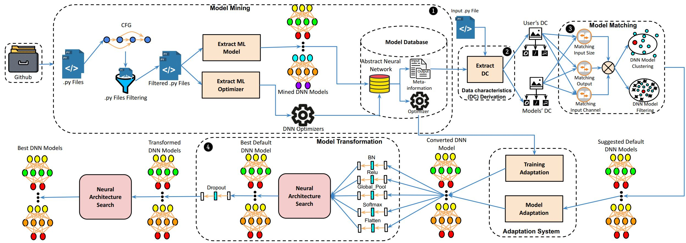

# Manas
This repository contains the source code, benchmark models, and datasets for the paper - **"Manas: Mining Software Repositories to Assist AutoML"**, appeared in ICSE 2022 at Pittsburgh, Pennsylvania, United States.

### Authors
* Giang Nguyen, Iowa State University (gnguyen@iastate.edu)
* Md Johirul Islam, Amazon (johirbuet@gmail.com)
* Rangeet Pan, IBM Research (rangeet.pan@ibm.com)
* Hridesh Rajan, Iowa State University (hridesh@iastate.edu)
  
### Abstract
Today deep learning is widely used for building software. A software engineering problem with deep learning is that finding an appropriate convolutional neural network (CNN) model for the task can be a challenge for developers. Recent work on AutoML, more precisely neural architecture search (NAS), embodied by tools like Auto-Keras aims to solve this problem by essentially viewing it as a search problem where the starting point is a default CNN model, and mutation of this CNN model allows exploration of the space of CNN models to find a CNN model that will work best for the problem. These works have had significant success in producing high-accuracy CNN models. There are two problems, however. First, NAS can be very costly, often taking several hours to complete. Second, CNN models produced by NAS can be very complex that makes it harder to understand them and costlier to train them. We propose a novel approach for NAS, where instead of starting from a default CNN model, the initial model is selected from a repository of models extracted from GitHub. The intuition being that developers solving a similar problem may have developed a better starting point compared to the default model. We also analyze common layer patterns of CNN models in the wild to understand changes that the developers make to improve their models. Our approach uses commonly occurring changes as mutation operators
in NAS. We have extended Auto-Keras to implement our approach. Our evaluation using 8 top voted problems from Kaggle for tasks including image classification and image regression shows that given the same search time, without loss of accuracy, Manas produces models with 42.9% to 99.6% fewer number of parameters than Auto-Keras’ models. Benchmarked on GPU, Manas’ models train 30.3% to 641.6% faster than Auto-Keras’ models.

We use Pycharm to run the program conveniently.

Download Pycharm from https://www.jetbrains.com/pycharm/ and install Pycharm.

Step 1: open Pycharm

Step 2: go to File, then go to Open.

Step 3: choose the directory of Manas to open the project.

1. Model mining:
To mine the model run the file clone/model_mining/database_creation/model_collection.py
Mining model will take time, we already download the models located in autokeras/mined_model. The models is stored in form of abstract neural network (ANN).

2. Manas:

The data of Manas paper can be downloaded from: https://drive.google.com/file/d/1x8jZ27Ho9tZ5H1bVOvOCQB0xpi6n3FnN/view?usp=sharing

Data contains:

- Python files to reproduce the results. 

- Training and testing data.

- Trained models of Original Manas, Transformed Manas, Manas, and Auto-Keras in form of pkl files.

- Excel files for error rates of Original Manas, Transformed Manas, Manas, and Auto-Keras over time. These error can also be shown by using trained models (pkl files).

Example to reproduce Manas results:

We use Blood Cell problem as an example.

Step 1: Extract zip file.

Step 2: copy the "Blood Cell.py", "xtest_bc.npy", "ytest_bc.npy", "xtrain_bc.npy", "ytrain_bc.npy" to "autokeras"

Step 3: Run the file "Blood Cell.py" to get the result.

Example to evaluate trained models:

In the folder autokeras, there is a file "eval.py" which contains the code to run the trained models on the testing data.

Step 1: Replace "path" with correct path.

Step 2: Run the file "eval.py" 
